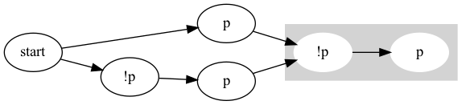

# Overview

LTL2TL is a tool which generates timeline visualizations for Linear temporal logic (LTL) formulas. It provides two utilities:
- `ltl2timeline`, for translating LTL formulas to timeline graphic images; and
- `ltl2regex`, for translating LTL formulas to regular expressions representing the solution set of the formula. 

The tool works by transforming LTL formulae to Büchi automata (provided by [SPOT](https://spot.lre.epita.fr/)) and subsequently to $\omega$-regular expressions and timeline graphics. It is intended for validating software system specification formulas written in LTL. 

Installation, usage and examples are provided below.

# Installation
## Dependencies
- SPOT (Download [here](https://spot.lre.epita.fr/install.html) and use the following command in the root directory of your installation)
```
$ ./configure --prefix ~/.local && make && sudo make install
```
- Graphviz
```
$ brew install graphviz
```
- Python 3.10+
- Other packages
```
$ pip install -r requirements.txt
```

After installing dependencies, update git submodule via
```bash
$ git submodule init
$ git submodule update
```

# Usage
We provide 2 command-line tools:
- ltl2regex
```
NAME
    main.py ltl2regex

SYNOPSIS
    main.py ltl2regex FORMULA

POSITIONAL ARGUMENTS
    FORMULA
        Type: str
```
- ltl2timeline
```
NAME
    main.py ltl2timeline

SYNOPSIS
    main.py ltl2timeline FORMULA <flags>

POSITIONAL ARGUMENTS
    FORMULA
        Type: str

FLAGS
    --filename=FILENAME
        Type: str
        Default: 'ltl'
    --output_format=OUTPUT_FORMAT
        Type: str
        Default: 'pdf'
        Supported values: ['pdf', 'png', 'svg', 'latex']
```

## Examples
LTL Formulas are inputted following the same syntax as [SPOT](https://spot.lre.epita.fr/app/). For example,

```
python3 main.py ltl2timeline 'G(p xor X p)'
```
generates the following timeline

